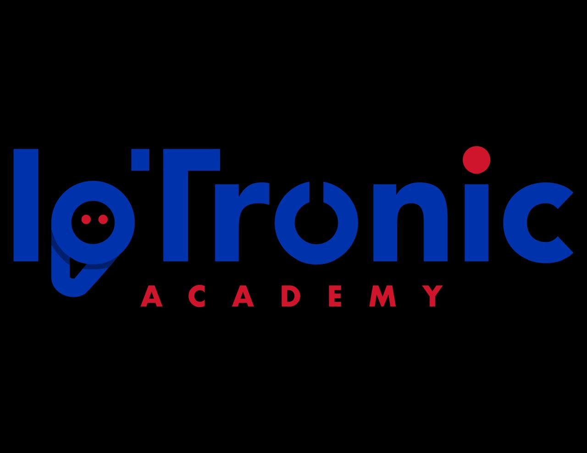

#  WRO Future Engineers

## Content

* `t-photos` contains 2 photos of the team (an official one and one funny photo with all team members).
* `v-photos` contains 6 photos of the vehicle (from every side, from top and bottom).
* `video` contains the video.md file with the link to a video where the driving demonstration exists.
* `schemes` contains one or several schematic diagrams in the form of JPEG, PNG, or PDF of the electromechanical components illustrating all the elements (electronic components and motors) used in the vehicle and how they connect to each other.
* `src` contains the code of control software for all components that were programmed to participate in the competition.
* `models` is for the files for models used by 3D printers, laser cutting machines, and CNC machines to produce the vehicle elements. If there is nothing to add to this location, the directory can be removed.
* `other` is for other files which can be used to                       understand how to prepare the vehicle for the competition. It may include documentation on how to connect to an SBC/SBM and upload files there, datasets, hardware specifications, communication protocols descriptions, etc. If there is nothing to add to this location, the directory can be removed.

## Introduction

The robot in question is equipped with a series of technological components designed to optimize its obstacle detection capabilities in this WRO robotics competition. Among its main features are three range sensors, a camera, an RGB line sensor, two motors with encoders, and two servos. Each of these elements plays a significant role in the robot's operation and maneuverability.

The range sensors are crucial for the robot's navigation. These sensors are strategically positioned to allow precise detection of obstacles in the robot's environment. Typically, range sensors operate by emitting ultrasonic waves or lasers that bounce back to the sensor upon hitting an object. This return is measured to determine the distance between the sensor and the obstacle. In the robot's case, the three range sensors are distributed such that one is oriented forward while the other two are positioned on the sides. This arrangement provides wide coverage of the environment, enabling the robot to detect obstacles not only directly in front of it but also around it. This is particularly useful for avoiding collisions with walls and other nearby objects. The front sensor provides information about obstacles directly in the robot's path, while the side sensors are essential for more complex maneuvers, such as turns or direction changes when encountering side obstacles.

The camera mounted on the robot serves a specific purpose related to obstacle color detection. This camera is equipped to identify two primary colors: red and green. The ability to detect the color of an obstacle allows the robot to make more informed decisions about its behavior. For instance, if the robot detects a red-colored obstacle, it may be programmed to avoid it differently than it would a green obstacle. The camera uses image processing to identify and distinguish these colors, which involves a series of algorithms that analyze the captured image to extract relevant information about the environment.

In addition to the range sensors and the camera, the robot is equipped with an RGB line sensor. This sensor is designed to detect specific colored lines on the ground, in this case, orange and blue. The primary function of the RGB line sensor is to allow the robot to follow predefined routes based on the colors detected on the ground. For example, if the robot is programmed to follow a blue line, the RGB sensor will identify that line and adjust the robot's movement to stay on it. This type of control is essential for applications where the robot must follow a specific path or avoid certain zones marked by colors.

As for the motors, the robot is equipped with two motors with encoders. Encoders are devices that provide precise feedback on the motors' speed and position, which is crucial for controlling the robot's movement. Encoders convert the rotational motion of the motors into digital signals that can be interpreted by the robot's control system. This allows fine adjustments to the robot's speed and direction, as well as greater precision in maneuvers. Motors with encoders enable the robot to move more controlled and precisely, facilitating navigation in complex environments and the execution of specific tasks.

The robot is also equipped with two servos, each with a distinct function. The first servo is connected to a wheel system responsible for steering the robot. This servo adjusts the angle of the wheels, allowing the robot to turn and change direction precisely. The ability to modify the wheel's direction is essential for the robot's maneuverability, enabling it to make turns and movements in different directions easily.

The second servo is intended to adjust the camera's angle. This adjustment capability is particularly useful for changing the perspective from which the robot is observing its environment. For example, the camera angle can be adjusted to obtain a clearer view of an obstacle or to change the camera's orientation based on the robot's needs at any given moment. Adjusting the camera angle allows for greater flexibility in detecting and analyzing the environment, adapting to different situations and navigation scenarios.

The robot was constructed using a Makeblock CiberPi, as it allows for functionalities that provide a better structure for the robot. The code compilation and upload process is done via USB-C or Bluetooth, and the program also allows for a preview without uploading the code, showing the programming in real time.

---

#  WRO Future Engineers

## Contenido

* `t-photos` contiene 2 fotos del equipo (una oficial y una foto divertida con todos los miembros del equipo).
* `v-photos` contiene 6 fotos del vehículo (de todos los lados, desde arriba y desde abajo).
* `video` contiene el archivo video.md con el enlace a un video donde se muestra la demostración de conducción.
* `schemes` contiene uno o varios diagramas esquemáticos en forma de JPEG, PNG o PDF de los componentes electromecánicos que ilustran todos los elementos (componentes electrónicos y motores) utilizados en el vehículo y cómo se conectan entre sí.
* `src` contiene el código del software de control para todos los componentes que fueron programados para participar en la competencia.
* `models` es para los archivos de los modelos utilizados por impresoras 3D, máquinas de corte por láser y máquinas CNC para producir los elementos del vehículo. Si no hay nada que agregar a esta ubicación, el directorio puede eliminarse.
* `other` es para otros archivos que pueden usarse para comprender cómo preparar el vehículo para la competencia. Puede incluir documentación sobre cómo conectarse a un SBC/SBM y cargar archivos allí, conjuntos de datos, especificaciones de hardware, descripciones de protocolos de comunicación, etc. Si no hay nada que agregar a esta ubicación, el directorio puede eliminarse.

## Introducción

El robot en cuestión está equipado con una serie de componentes tecnológicos diseñados para optimizar su capacidad de detección de obstáculos en esta competencia de robótica WRO. Entre sus principales características se incluyen tres sensores de rango, una cámara, un sensor de línea RGB, dos motores con encoder y dos servos. Cada uno de estos elementos juega un papel importante en el funcionamiento y la maniobrabilidad del robot.

Los sensores de rango son fundamentales para la navegación del robot. Estos sensores están situados en posiciones estratégicas para permitir una detección precisa de obstáculos en el entorno del robot. Generalmente, los sensores de rango operan mediante la emisión de ondas ultrasónicas o láseres que, al impactar con un objeto, rebotan de vuelta al sensor. Este retorno es medido para determinar la distancia entre el sensor y el obstáculo. En el caso del robot, los tres sensores de rango están distribuidos de tal manera que uno está orientado hacia adelante, mientras que los otros dos están posicionados a los lados. Esta disposición permite una cobertura amplia del entorno, haciendo que el robot sea capaz de detectar obstáculos no solo directamente frente a él, sino también a su alrededor. Esto es especialmente útil para evitar colisiones con paredes y otros objetos cercanos. El sensor frontal proporciona información sobre obstáculos directamente en el camino del robot, mientras que los sensores laterales son esenciales para maniobras más complejas, como las vueltas o cambios de dirección cuando se encuentra con obstáculos en los laterales.

La cámara montada en el robot tiene un propósito específico relacionado con la detección del color de los obstáculos. Esta cámara está equipada para identificar dos colores principales: rojo y verde. La capacidad de detectar el color del obstáculo permite al robot tomar decisiones más informadas sobre su comportamiento. Por ejemplo, si el robot detecta un obstáculo de color rojo, podría estar programado para evitarlo de una manera diferente en comparación con un obstáculo verde. La cámara utiliza procesamiento de imágenes para identificar y distinguir estos colores, lo que implica una serie de algoritmos que analizan la imagen capturada para extraer información relevante sobre el entorno.

Además de los sensores de rango y la cámara, el robot cuenta con un sensor de línea RGB. Este sensor está diseñado para detectar líneas de colores específicos en el suelo, en este caso, naranja y azul. La función principal del sensor de línea RGB es permitir que el robot siga rutas predefinidas basadas en los colores detectados en el suelo. Por ejemplo, si el robot está programado para seguir una línea azul, el sensor RGB identificará esa línea y ajustará el movimiento del robot para mantenerse sobre ella. Este tipo de control es esencial para aplicaciones donde el robot debe seguir una trayectoria específica o evitar zonas determinadas marcadas por colores.

En cuanto a los motores, el robot está equipado con dos motores con encoder. Los encoders son dispositivos que proporcionan retroalimentación precisa sobre la velocidad y la posición de los motores, lo que es crucial para el control del movimiento del robot. Los encoders convierten el movimiento rotacional de los motores en señales digitales que pueden ser interpretadas por el sistema de control del robot. Esto permite un ajuste fino de la velocidad y la dirección del robot, así como una mayor precisión en las maniobras. Los motores con encoder permiten al robot moverse de manera más controlada y precisa, facilitando la navegación en entornos complejos y la ejecución de tareas específicas.

El robot también está equipado con dos servos, cada uno con una función distinta. El primer servo está conectado a un sistema de ruedas que se encarga de proporcionar la dirección del robot. Este servo ajusta el ángulo de las ruedas, permitiendo al robot girar y cambiar de dirección con precisión. La capacidad de modificar la dirección de las ruedas es esencial para la maniobrabilidad del robot, permitiéndole realizar giros y desplazamientos en diferentes direcciones con facilidad.

El segundo servo está destinado a ajustar el ángulo de la cámara. Esta capacidad de ajuste es particularmente útil para cambiar la perspectiva desde la cual el robot está observando su entorno. Por ejemplo, el ángulo de la cámara puede ser ajustado para obtener una visión más clara de un obstáculo o para cambiar la orientación de la cámara en función de las necesidades del robot en un momento dado. El ajuste del ángulo de la cámara permite una mayor flexibilidad en la detección y el análisis del entorno, adaptándose a diferentes situaciones y escenarios de navegación.

Para el proceso de construcción del robot, se hicieron a través de un CiberPi de Makeblock, ya que nos permite usar funcionalidades para una mejor estructura del robot. La compilación y la forma de cargar el código se hace a través de USB-C o por bluetooth, a demás es programa nos permite tener una visualización previa sin cargar el código, mostrando en tiempo real la programación.
